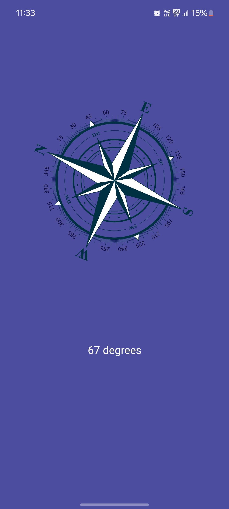

# Compass App

Welcome to the **Compass App** repository! This project is an Android application that uses the device's orientation sensor to display a compass.

## Table of Contents

- [Introduction](#introduction)
- [Features](#features)
- [Screenshots](#screenshots)
- [Installation](#installation)
- [Usage](#usage)
- [Technologies](#technologies)
- [Contributing](#contributing)
- [License](#license)

## Introduction

The **Compass App** is a simple Android application designed to help users determine their direction using the built-in sensors on their device. The app displays a compass rose and the current direction in degrees.

## Features

- Displays a dynamic compass image
- Shows the current heading in degrees
- Utilizes device sensors for real-time direction updates
- Edge-to-edge user interface for a modern look

## Screenshots

![Compass Screen]
*Screenshot of the compass interface.*

## Installation

1. Clone the repository:

   ```bash
   git clone https://github.com/akarsh/compassapp.git
   ```

2. Open the project in [Android Studio](https://developer.android.com/studio).

3. Build and run the app on an Android device or emulator.

## Usage

1. Open the Compass App on your Android device.
2. The compass image will rotate to indicate the direction you are facing.
3. The degree value shown on the screen represents the current heading in degrees.

## Technologies

- **Language:** Kotlin
- **Platform:** Android
- **Sensor:** Orientation Sensor (deprecated, consider using the rotation vector sensor for more accuracy)

## Contributing

Contributions are welcome! Please follow these steps to contribute:

1. Fork the repository.
2. Create a new branch (`git checkout -b feature-branch`).
3. Commit your changes (`git commit -m 'Add some feature'`).
4. Push to the branch (`git push origin feature-branch`).
5. Open a Pull Request.

## License

This project is licensed under the MIT License - see the [LICENSE](LICENSE) file for details.

---

**Note:** This project uses the deprecated orientation sensor. For improved accuracy and compatibility, consider using the rotation vector sensor or the accelerometer and magnetometer combination.
